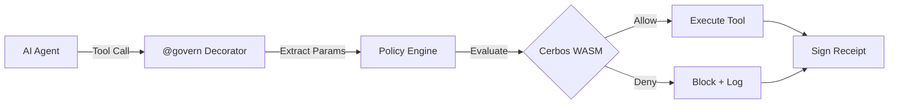

# 🧠 GlassTape — Zero-Trust Runtime Governance for AI Agents

[](https://opensource.org/licenses/Apache-2.0)
[](https://www.python.org/downloads/)
[](https://cerbos.dev/)
[](https://github.com/glasstape/glasstape-sdk-python/actions)

> **Zero-trust runtime governance for AI agents — enforce policies at the reasoning-to-action boundary.**  
> Intercept every agent tool call (payments, DB, API) and enforce declarative policies with sub-10ms evaluation and cryptographic decision receipts (Ed25519).

**TL;DR:** GlassTape v1.0 is a Python SDK that adds `@govern` decorators to AI agent tools for policy enforcement. Works offline with Cerbos WASM. Includes Policy Builder MCP for natural language → YAML policy generation. Prevents OWASP Top 10 AI vulnerabilities with cryptographic audit trails.

**Quick links:** [Quick Start](#-quick-start-30s) · [Policy Builder MCP](https://github.com/GlassTape/agent-policy-builder-mcp) · [OWASP Mitigation](#%EF%B8%8F-ai-agent-security-owasp-top-10-mitigation)

---

## 📖 Overview

**GlassTape SDK** is a Python library that enforces declarative policies on AI agent tool calls at runtime. Intercepts every action — payments, database queries, API calls — and evaluates them against Cerbos policies **before execution** in under 10ms, with cryptographic proof for every decision.

### The Problem: The Invisible Cliff

Hardcoded guardrails in AI agent code break at scale:

- **Model migrations** (GPT-4 → Claude) break hardcoded response parsing
- **Scattered security logic** across repositories — no central visibility for audits
- **Framework fragmentation** — LangChain, CrewAI, Strands all implement security differently
- **No audit trails** — legal can't trace agent decisions back to reasoning
- **Prompt guardrails fail** — can't enforce business policies or generate compliance proof

**The invisible cliff**: prototypes work, production deployments collapse.

### The Solution

GlassTape separates governance from application code. Every tool call is evaluated against centralized policies with:

- ⚡ **Sub-10ms enforcement** (Cerbos WASM)
- 🔒 **Zero network calls** (works offline)
- 🔐 **Ed25519 signatures** (non-repudiation)
- 🛡️ **Framework-agnostic** (LangChain, CrewAI, Strands, custom agents)
- 📝 **Survives migrations** (policies separate from code)

---

## 🚀 Quick Start (30s)

```bash
pip install glasstape
```

```python
from glasstape import configure, set_context, govern

# Configure SDK
configure(agent_id="finance-agent", mode="local", policy_dir="./policies")

# Request-scoped context
set_context(user_id="analyst-1", user_role="analyst")

# Add governance
@govern("finance.payments.v1")
def process_payment(amount: float, recipient: str):
    return payment_api.charge(amount, recipient)

# Usage
try:
    process_payment(5000.0, "vendor-x")
except GovernanceError as e:
    print("Blocked:", e)
```

### Create a Policy

**Option A: Use Policy Builder (Recommended)**

Use [GlassTape Policy Builder](https://github.com/GlassTape/agent-policy-builder-mcp) — an AI-powered MCP server that transforms natural language into production-ready Cerbos policies.

**In your IDE (Cursor, Claude Desktop, AWS Q):**
```
Generate a payment policy for AI agents:
- Allow payments up to $1000
- Only allow for finance managers and admins
- Block sanctioned entities
```

**Option B: Write Manually**

Save as `policies/finance.payments.v1.yaml`:

```yaml
apiVersion: api.cerbos.dev/v1
resourcePolicy:
  version: "1.0"
  resource: "payment"
  rules:
    - actions: ['process']
      effect: EFFECT_ALLOW
      roles: [agent]
      condition:
        match:
          expr: >
            request.resource.attr.amount <= 1000.0 &&
            request.principal.attr.user_role in ["admin", "finance_manager"]
```

---

## 🏗️ How It Works



### Architecture

```
┌──────────────┐     ┌────────────┐     ┌─────────────┐
│  LLM Agent   │──▶──│ GlassTape  │──▶──│   Tool/API  │
│ (LangChain)  │     │   @govern  │     │ (DB, Pay)   │
└──────────────┘     └────────────┘     └─────────────┘
        │                   │
        ▼                   ▼
   Reasoning         Policy Evaluation
                    + Cryptographic Receipt
```

**Key Components:**
- **Decorators** (`@govern`, `@monitor`) — User-facing API
- **Policy Engine** — Cerbos WASM evaluation with caching
- **Context Management** — Thread-safe context injection
- **Cryptography** — Ed25519 signing for non-repudiation
- **Mode Router** — Extensible architecture (local, platform modes)

---

## 🎯 Use Cases

### 🏦 Financial Services

**Problem:** AI agents processing payments need strict limits, role checks, and fraud detection.

```python
from glasstape import configure, govern, set_context

configure(agent_id="finance-agent")

@govern("finance.payments.v1")
def process_payment(amount: float, recipient: str):
    return payment_api.charge(amount, recipient)

# Set user context
set_context(user_id="analyst-123", user_role="analyst")

try:
    process_payment(5000.0, "vendor-x")  # Blocked: analyst not authorized
except GovernanceError as e:
    print(f"Payment blocked: {e}")
```

**Policies enforce:**
- Payment limits ($1K for analysts, $10K for managers)
- Blocked entity checks (OFAC sanctions)
- Rate limiting (5 transactions per 5 minutes)

### 🏥 Healthcare (HIPAA)

```python
set_context(
    user_id="nurse-456",
    user_role="nurse",
    patient_consent=True
)

@govern("healthcare.phi.access.v1")
def get_patient_records(patient_id: str, fields: list):
    """Access patient records - HIPAA governed"""
    return ehr_system.query(patient_id, fields)
```

**Policies enforce:**
- Role-based access (doctors vs nurses)
- Patient consent checks
- Minimum necessary (field-level access)
- Audit logging (HIPAA compliance)

### 🛡️ PII Protection (GDPR/CCPA)

```python
set_context(
    user_id="agent-789",
    user_role="support_tier1",
    purpose="customer_inquiry"
)

@govern("data.pii.access.v1")
def get_customer_data(customer_id: str, fields: list):
    """Query customer data - PII protected"""
    return crm.query(customer_id, fields)
```

**Policies enforce:**
- Field-level access control (tier1 cannot see SSN)
- Purpose limitation (legitimate business purposes only)
- Data minimization (only requested fields)

### 🛡️ Prompt Injection & Jailbreak Prevention

**Problem:** AI agents vulnerable to evasive attacks that bypass hardcoded guardrails through clever prompting.

```python
set_context(
    user_id="user-123",
    user_role="standard_user",
    session_id="sess-456"
)

@govern("security.spending_limits.v1")
def make_purchase(amount: float, item: str):
    """Purchase with spending limits - jailbreak resistant"""
    return payment_system.charge(amount, item)

# Policy: max $50 per transaction for standard users
# Attack attempts:
try:
    make_purchase(30.0, "item1")  # ✓ Allowed
    make_purchase(40.0, "item2")  # ✗ Blocked - cumulative limit check
except GovernanceError as e:
    print(f"Jailbreak attempt blocked: {e}")
```

**Policies enforce:**
- Cumulative spending limits (prevents split-transaction attacks)
- Rate limiting (blocks rapid-fire attempts)
- Context-aware decisions (session tracking)
- Cryptographic audit trails (detect evasion patterns)

---

## 🧩 Framework Integration

### LangGraph

```python
from langgraph.prebuilt import create_react_agent
from glasstape import configure, govern

configure(agent_id="weather-agent")

@govern("weather.city_monitoring.v1")
def get_weather(city: str) -> str:
    return f"Weather in {city}: 72°F, sunny"

agent = create_react_agent(
    model="anthropic:claude-3-5-sonnet-latest",
    tools=[get_weather]
)

result = agent.invoke({
    "messages": [{"role": "user", "content": "What's the weather in SF?"}]
})
```

### LangChain

```python
from langchain.tools import tool
from glasstape import govern

@tool
@govern("langchain.tools.v1")
def my_tool(query: str) -> str:
    """A governed LangChain tool"""
    return process(query)
```

### AWS Strands

```python
from strands import Agent
from glasstape import configure, govern

configure(agent_id="trading-agent")

@govern("finance.trading.v1")
def execute_trade(symbol: str, quantity: int):
    return f"Executed trade: {quantity} shares of {symbol}"

agent = Agent(tools=[execute_trade])
result = agent.run("Buy 100 shares of AAPL")
```

---

## ⚙️ Configuration

### Environment Variables

```bash
# Basic configuration
GT_AGENT_ID="my-agent"
GT_POLICY_DIR="./policies"
GT_LOG_FILE="./glasstape.log"

# LLM integration (optional, for parameter extraction)
GT_LLM_PROVIDER="openai"  # or "anthropic"
GT_LLM_MODEL="gpt-4o-mini"
OPENAI_API_KEY="your-key"

# Cryptography
GT_ED25519_PRIVATE_KEY="your-private-key"  # Auto-generated if not provided
GT_KEYS_DIR="~/.glasstape/keys"

# Performance
GT_CACHE_TTL="300"  # 5 minutes
GT_CERBOS_WASM_ENABLED="true"
GT_DEBUG="true"
```

### Programmatic Configuration

```python
from glasstape import configure
import os

config = configure(
    agent_id="finance-agent",
    org_id="acme-corp",
    policy_dir="./policies",
    llm_provider="openai",
    llm_api_key=os.getenv("OPENAI_API_KEY"),
    llm_model="gpt-4o-mini",
    debug=True
)
```

---

## 🔐 Security Model

### Multi-Agent Cryptographic Identity

- **Per-Agent Keypairs** — Each agent (`finance-agent`, `service-agent`) has unique Ed25519 identity
- **Signed Decisions** — Every policy decision cryptographically signed with agent's private key
- **Agent Traceability** — Know exactly which agent performed which action when
- **Non-Repudiation** — Audit trails with legal admissibility for compliance
- **Fail-Closed Security** — Default deny on policy evaluation errors or missing context

### Decision Receipt Format

```json
{
  "agent_id": "finance-agent",
  "tool_name": "process_payment",
  "policy_id": "finance.payments.v1",
  "decision": "deny",
  "reason": "amount 5000.0 exceeds limit 1000.0",
  "context": {
    "user_id": "analyst-123",
    "user_role": "analyst"
  },
  "timestamp": "2025-11-12T10:30:00Z",
  "signature": "ed25519:...",
  "context_hash": "sha256:..."
}
```

---

## 🔒 Security Notes

**Key Management:**
- Never commit `GT_ED25519_PRIVATE_KEY` to repositories
- Use environment variables or secure key management (AWS KMS, HashiCorp Vault)
- Keys are auto-generated if not provided (stored in `~/.glasstape/keys/`)

**Compliance:**
- Decision receipts designed to support audit requirements (SOC 2, HIPAA, EU AI Act)
- Consult legal counsel for country-specific compliance rules
- Ed25519 signatures provide cryptographic non-repudiation for legal admissibility

---

## 🏠 Deployment Modes

### Local Mode (v1.0 - This Release)

```python
configure(mode="local", policy_dir="./policies")
```

**What you get:**
- ⚡ Sub-10ms enforcement with Cerbos WASM
- 🔒 Zero network calls — works completely offline
- 🛡️ Complete data privacy — policies and logs never leave your infrastructure
- 🔐 Ed25519 signatures — cryptographic proof for every decision
- 🎯 Multi-agent support — per-agent identity and signing keys

**Perfect for:**
- Development and testing
- Production deployments (offline/air-gapped)
- Privacy-sensitive applications (HIPAA, financial services)
- Open-source projects

**No API keys. No signups. No network dependencies.**

---

### Platform Mode (Coming in v2.0)

For enterprises needing centralized policy management:

```python
configure(
    mode="platform",
    platform_url="https://api.glasstape.ai",
    api_key="..."
)
```

**Additional capabilities:**
- Centralized policy management with Git workflows
- Team collaboration and approval gates
- Real-time analytics and compliance dashboards
- SIEM integration (Splunk, Datadog)
- SSO/SCIM enterprise authentication

**Migration:** Same decorators, same policies. Just change the `mode` in config.

[Join the waitlist →](mailto:hello@glasstape.ai?subject=Platform%20Mode%20Waitlist)

---

## 📚 Advanced Examples

### Advanced Policy: Rate Limiting

```yaml
apiVersion: api.cerbos.dev/v1
resourcePolicy:
  version: "1.0"
  resource: "api_call"
  rules:
    - actions: ['execute']
      effect: EFFECT_ALLOW
      condition:
        match:
          expr: >
            request.resource.attr.calls_per_minute < 100 &&
            request.principal.attr.user_tier in ["premium", "enterprise"]
```

### Advanced Policy: PII Protection

```yaml
apiVersion: api.cerbos.dev/v1
resourcePolicy:
  version: "1.0"
  resource: "email"
  rules:
    - actions: ['send']
      effect: EFFECT_DENY
      condition:
        match:
          expr: >
            "ssn" in request.resource.attr.content ||
            "credit_card" in request.resource.attr.content
```

---

## 🧪 Testing

```bash
# Run tests
pytest test/ -v

# Run with coverage
pytest test/ -v --cov=glasstape

# Test specific functionality
python test/simple_test.py
```

**Example Test:**

```python
import pytest
from glasstape import configure, govern, set_context, GovernanceError

@pytest.fixture
def setup_governance():
    configure(
        agent_id="test-agent",
        policy_dir="./test_policies",
        debug=True
    )

def test_payment_under_limit(setup_governance):
    set_context(user_role="admin")
    
    @govern("finance.payments.v1")
    def process_payment(amount: float):
        return f"Processed ${amount}"
    
    result = process_payment(500.00)
    assert result == "Processed $500.0"

def test_payment_over_limit(setup_governance):
    set_context(user_role="analyst")
    
    @govern("finance.payments.v1")
    def process_payment(amount: float):
        return f"Processed ${amount}"
    
    with pytest.raises(GovernanceError):
        process_payment(5000.00)
```

---

## 🛠️ Development

```bash
# Clone repository
git clone https://github.com/glasstape/glasstape-sdk-python.git
cd glasstape-sdk-python

# Install in development mode
pip install -e .
pip install -e ".[dev]"

# Run examples
python examples/example_v7_1.py
```

---

## ❓ FAQ

### How is this different from LangChain's built-in tools?

LangChain provides tool schemas and execution. GlassTape provides **governance** — policy enforcement, audit trails, and non-repudiation. They complement each other.

### Do I need the internet to use GlassTape?

No! Local mode works completely offline. Perfect for air-gapped environments.

### What's the performance overhead?

Sub-10ms per enforcement with Cerbos WASM. Your agents won't notice.


---

## 🗺️ Roadmap

### ✅ v1.0 - Local Mode (Current)
- File-based policies
- Cerbos WASM evaluation
- Ed25519 signatures
- Local audit logging
- Multi-agent support
- LLM parameter extraction

### 🚧 v2.0 - Platform Mode (Planned 2026)
- API-based policy fetching
- Centralized policy management
- Remote audit logging
- Policy versioning and Git workflows
- Analytics dashboard
- Team collaboration with approval gates
- SIEM integration (Splunk, Datadog)
- SSO/SCIM enterprise authentication

---

## 🤝 Contributing

We welcome contributions! See [CONTRIBUTING.md](CONTRIBUTING.md) for guidelines.

**Quick Links:**
- [Code of Conduct](CODE_OF_CONDUCT.md)
- [Security Policy](SECURITY.md)
- [Architecture Documentation](ARCHITECTURE.md)

---

## 📄 License

Released under the [Apache 2.0 License](LICENSE).
© 2025 GlassTape, Inc.

---

<div align="center">

**Making AI Agents Secure by Default**

*Zero-trust governance at the reasoning-to-action boundary.*


[Get Started](#-quick-start-30s) · [Star on GitHub](https://github.com/glasstape/glasstape-sdk-python) · [Contact Us](mailto:hello@glasstape.ai)

</div>
